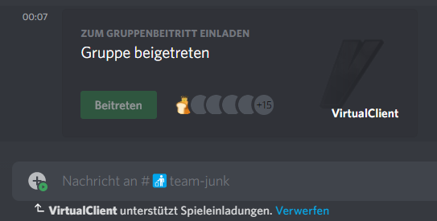
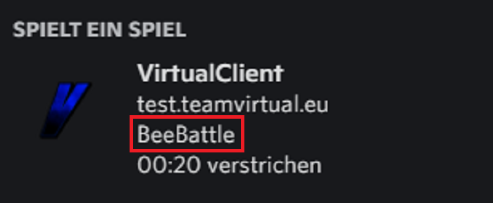

# 🤖 Discord-RPC

The VirtualClient listens for packets on the `"virtualclient:serverapi"` channel as described [here](getting-started/#messaging). The packet for Discord-RPC has the identifier `"discordrpc"`.

## Payload

The payload looks something like this. The documentation below will show what they do and how to use them exactly.

```json
{
    //Optional - if the field is not set it won't change anything.
    //If the field is an empty json object the secrets will be reset.
    //If it contains content the secrets will be updated.
    "secrets": {
        "domain": "cafestu.be",
        "joinSecret": "iamasupersecretforjoin", //Optional
        "spectateSecret": "iamasupersecretforspectate", //Optional
        "matchSecret": "iamasupersecretformatch" //Optional
    },
    
    //Optional - if the field is not set it won't change anything.
    //If the field is an empty json object the party will be reset.
    //If it contains content the party will be updated.
    "party": {
        "domain": "cafestu.be",
        "partyId": "partyId",
        "size": 5,
        "maxSize": 10
    },
    
    //Optional - if the field is not set it won't change anything.
    //If it is set to false it will remove the gamemode.
    //If it is set to true it will set a new gamemode based on the gameMode field.
    "hasGameMode": true,
    "gameMode": "BeeBattle"
}
```

Lean more about packet and their payloads [here](getting-started/#packet-structure).

## Discord-RPC Features

### Discord-RPC Secrets

The meaning of the secrets:

* `"spectateSecret"`: The secret used for joining games. Discord will show a join game button in the Discord-RPC of the user.
* `"joinSecret"`: The secret used for spectating games. Discord will show a spectate game button in the Discord-RPC of the user.
* `"matchSecret"`: A token to find out which players are playing together.

To reset, you can provide an empty object. Each secret is entirely optional, and only the domain needs to be present if the object is not empty.&#x20;

#### Listening for join requests with secrets

When a player has joined using the Discord-RPC the client will send the server the secret that the player used and what type of secret it is.&#x20;

The data of the client will be transmitted in the normal client channel with the identifier "discordrpc"

The payload looks like this:

```json
{
    "secret": "example-top-secret-secret",
    "secretType": "JOIN" //JOIN or SPECTATE
}
```

**WARNING: Please validate secrets!!! A modified client can send invalid data and when you move players to some other sub-server or do something else with them by using the secret they can do things you don't want them to.**

### Discord-RPC Parties

Discord Parties are used for invites you can send to other players. They show how many players are in the party, how many players can be in the party and expire after the party ID has been changed on the user that has sent the invite.

Make sure to update the party count when somebody joins!

**WARNING: This Feature requires a `joinSecret` to work.**



### Discord-RPC game-mode

The game-mode is a string that is shown to the user on the Discord-RPC.

When changing a game-mode, the timer in discord will automatically be reset.



